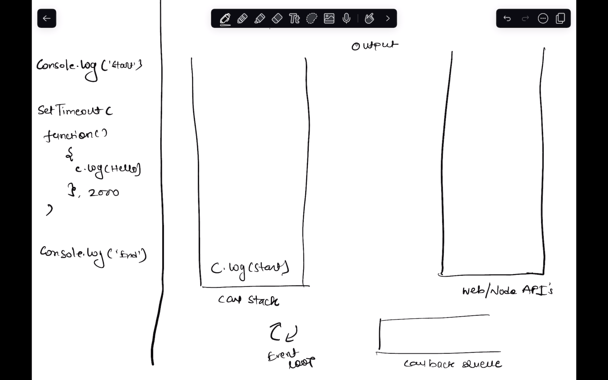
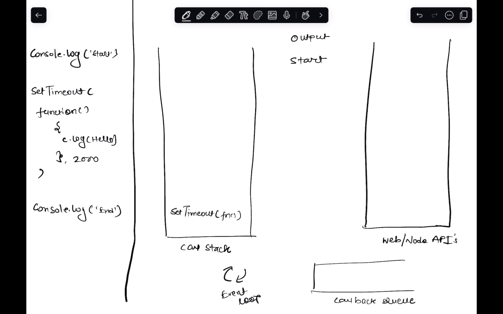
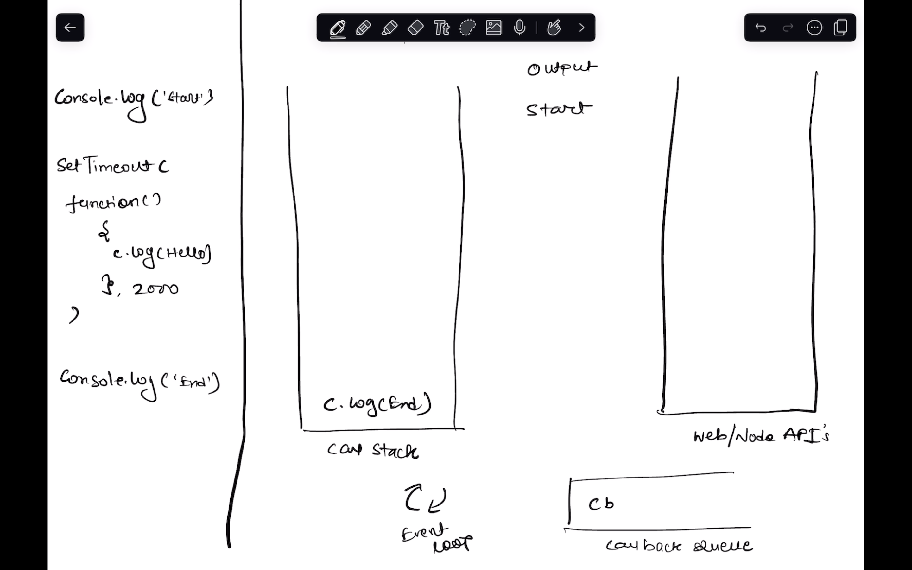
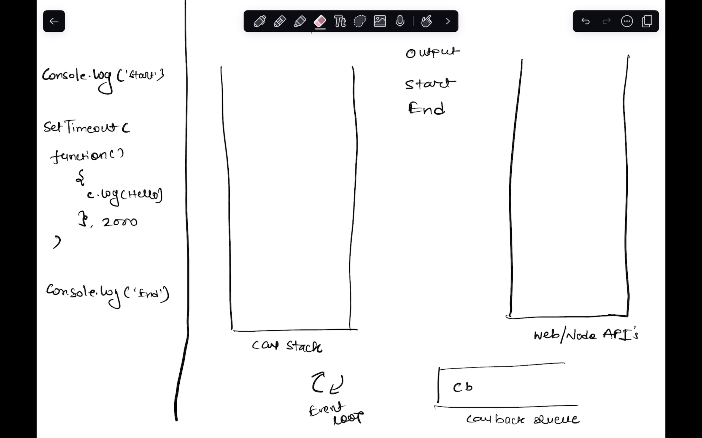
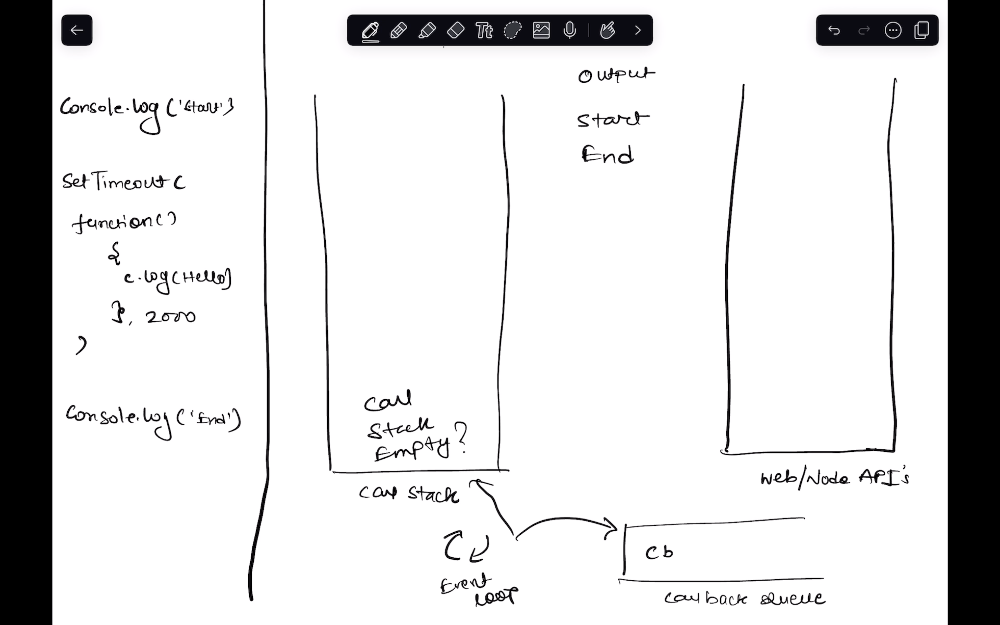

# Full Stack LLD & Projects: JavaScript-14: Asynchronous Programming 1


- Synchronous and asynchronous programming
- Callbacks (setTimeout)
- Event loop Mechanisam
- Async function using inbuilt modules
- parallel and Serial Operations


---
 Synchronous and asynchronous programming
description: 
duration: 900
card_type: cue_card
---

### Synchronous and Asynchronous Programming

Before directly jumping into the code , let's first understand what these two terms mean and let's relate it to real life


## Synchronous way of doing a task
Imagine you're at a coffee shop with a group of friends, and you all decide to order different types of coffee.

 after you place your coffee order at the counter, you have to stand right there and wait for the barista to make your coffee. You can't go sit down, chat with your friends, read a book, or do anything else. You're stuck waiting in line until your coffee is ready. Only after you've received your coffee and moved away from the counter can the next person in line order their coffee and start waiting.

This process repeats for each friend in your group, with each person ordering their coffee and then waiting for it to be prepared and handed to them before the next person can even place their order. This means if you're the fifth person in line, you have to wait for all four orders ahead of you to be completed before the barista can even start on yours.


In synchronous JavaScript, operations that take time to complete (like reading from a file or querying a database) block further execution of the code until they are finished. This can lead to a situation where the browser or the code appears frozen or unresponsive because it's waiting for each task to complete in turn before moving on to the next task, much like waiting for your coffee in a very slow, one-at-a-time manner.

Now would you like to stand in a queue like this?

Expext some answers from the learners maybe someone will point out that we can place the order and till the time order get's completed I can do other work , this will be a better approach right? 

So how this process can be less cumbersome? so the standing in queuee placing order and getting your coffee and the whole  waiting time for your coffee can be avoided?

 
Now, instead of standing at the counter waiting for your coffee to be made (synchronously waiting for a task to complete) you just place your order and move away from there to do other task while the barisata  starts preparing your coffee, you and your friends sit down at a table and chat, or maybe even read a book or scroll through your phone (doing other tasks).

As each coffee order is ready, the barista calls out the name associated with the order. When you hear your name (the callback), you go to the counter to pick up your coffee (the completion of an asynchronous operation). This way, you're not wasting time just standing and waiting; you're free to do other things while your coffee is being made, and you're notified when it's ready.

In asynchronous JavaScript, functions that take some time to complete (like fetching data from a server) don't stop the browser from doing other things. Instead, you provide a function that will be called back once the task is done, much like you getting your coffee only when it's ready, while the rest of your code can continue to run (like enjoying your time at the table). This makes for a more efficient and better user experience because the web page or the code doesn't freeze while waiting for tasks to complete.

What If I tell you this is the whole Principle of Asynchronous Programming 

Asynchronous programming is a programming paradigm that allows tasks to be executed independently of the main program flow and at the end we call the tasks get the results and Voila!


Now as we have a very Basic Idea of the behaviour of these two programming techniques.

let's understand this with the help of writing some code


---
Synchronous and Asynchronous Code Examples
description: 
duration: 900
card_type: cue_card
---


Look at this code Snippet and tell me the output?

**Synchronous Code:**

```javascript
console.log("Start");

function syncFunction() {
  console.log("Hello");
}

syncFunction();

console.log("End");
```

**output**

Start
Hello
End

Perfect!

In synchronous code, each statement executes one after the other in a sequential manner. So, "Start" is logged, then "Hello" is logged, and finally "End" is logged.


`setTimeout` is a JavaScript function used to execute a piece of code after a specified delay, measured in milliseconds. It allows you to schedule the execution of a function once, after the specified number of milliseconds have passed.

Here's how `setTimeout` works with a code example:

```javascript
// Define a function to be executed after a delay
function sayHello() {
  console.log("Hello!");
}

// Call setTimeout to schedule the execution of sayHello function after 2000 milliseconds (2 seconds)
setTimeout(sayHello, 2000);


// Output:
// (after 2 seconds)
// Hello!
```

In this example, the `sayHello` function is scheduled to be executed after a delay of 2000 milliseconds (2 seconds) using `setTimeout`. After the specified delay, the `sayHello` function is executed, printing "Hello!" to the console.


That's how the setTimeout works takes a callback executes it after a time period provided , Easy Peezy!

But this setTimeout is not only there to make delays , it's much more than that ,let's write some code and use setTimeout and see what it does

Now let's look this code Snippet

**Asynchronous Code:**

```javascript
console.log("Start");

setTimeout(function() {
  console.log("Hello");
}, 2000);

console.log("End");
```

In place of the syncFunction I have replaced it with a setTimeout 


Ask the learners to guess the output


and the output will be

Start
End
Hello (after 2 seconds)


What just Happened? 

In asynchronous code, `setTimeout` is a non-blocking function. It schedules a function to be executed after a specified delay and it will not block the main thread, As it will not block the same thread the program will continue to the next instruction . So, "Start" is logged, then "End" is logged, and after approximately 2 seconds, "Hello" is logged.

In synchronous code, execution happens in a predictable, blocking manner. Asynchronous code, on the other hand, allows non-blocking execution, where certain tasks can be delayed or executed independently of the main program flow.


But now , the main question is that how JS is managing all of these things? How was JS able to identify that setTimeout will run Asynchronusly? 


The answer is through it's Event Loop Mechanism

---
The Event Loop
description: 
duration: 900
card_type: cue_card
---


To understand the complete event loop mechanism we need to know 4 things as of now

- Call Stack
- Callback Queue
- Web/Node Apis
- Event Loop


Look at this diagram These are all the things that work togther to perform an asynchronous or non-blocking operation.

```javascript
console.log("Start");

setTimeout(function() {
  console.log("Hello");
}, 2000);

console.log("End");
```

We will take this code example only and let's do a dry run on how this code will work

Let's break the whole process step by step

**The Call Stack** - 

The code snippet you've provided is a simple JavaScript example demonstrating asynchronous execution using `setTimeout`. Here's how it operates, diagrammatically:

1. **Start of Execution**: The JavaScript engine starts running the script. The call stack and Web API environment are the primary areas of focus here.

2. **`console.log("Start")` Execution**: This line is executed immediately, printing "Start" to the console. It's placed on the call stack and then executed right away.




3. **`setTimeout` Function Call**: The `setTimeout` function is called with a callback function to be executed after 2 seconds. This call is placed on the call stack, and since `setTimeout` is a Web API, it's handed off to the browser environment to wait for the specified delay time (2000ms). The callback function is moved to the Web API environment, waiting for the timer to expire.




4. **`console.log("End")` Execution**: While the `setTimeout` callback is waiting, the execution continues, and `console.log("End")` is placed on the call stack and executed, printing "End" to the console.




5. **Callback Execution**: After the 2-second delay, the callback function from `setTimeout` is moved to the Callback Queue.




6. **Event Loop**: The Event Loop checks the Call Stack to see if it's empty (excluding the global execution context). Once it finds the Call Stack empty, it moves the callback function from the Callback Queue to the Call Stack.




7. **`console.log("Hello")` Execution**: Finally, the callback function is executed, printing "Hello" to the console.


Thus the Final Output becomes- 

Start
End
Hello


Below is a simplified diagrammatic representation of this process:

```
Call Stack                     Web APIs/NodeApis                 Callback Queue             Console
---------                      ---------                 --------------             -------
 |                              |                        |                           |
 | console.log("Start")         |                        |                        "Start"
 | -------------------------> Output                     |                           |
 |                              |                        |                           |
 | setTimeout(callback, 2000)  |                        |                           |
 |                              |---------------------->|                           |
 |                              |     (waits 2s)         |                           |
 | console.log("End")           |                        |                           |
 | -------------------------> Output                     |                        "End"
 |                              |                        |                           |
 |                              |                        | <-callback-               |
 |                              |                        |                           |
 | (empty, event loop checks)   |                        |                           |
 | <-------------------------- |                        |                        "Hello"
 |                              |                        |                           |
```

This represents the event-driven, non-blocking nature of JavaScript execution, where asynchronous callbacks are managed outside the main call stack to ensure the application doesn't block


---
Asynchronous Function using in-built modules

---


### Explanation

Lets consider an example:

```javascript 
// Import the 'fs' module
const fs = require("fs");

console.log('Before'); // This will be printed first

// Read file synchronously (blocking)
let data1 = fs.readFileSync('f1.txt'); // The execution is blocked until the file is read

console.log('This is File 1 data -> ' + data1); // This is printed after the file is read

// Note: Since this code is synchronous, it blocks the execution until the file is read completely.
```

In this code:

* The `fs` module is imported using require("fs").
* `console.log('Before')` is executed first and printed to the console.
* `fs.readFileSync('f1.txt')` reads the contents of `f1.txt` synchronously (blocking). This means the code execution waits until the file is read completely before moving to the next line.
* Once the file is read, `console.log('This is File 1 data -> ' + data1)` is executed and printed to the console.

 Here's how you can complete the asynchronous file reading:
 
```javascript 
// Import the 'fs' module
const fs = require("fs");

console.log('Before'); // This will be printed first

// Read file asynchronously (non-blocking)
fs.readFile('f1.txt', (err, data) => {
  if (err) {
    console.error('An error occurred:', err);
    return;
  }
  
  console.log('This is File 1 data -> ' + data); // This is printed when the file is read
});

console.log('After'); // This will be printed before the file is read
```

In this code:

* `console.log('Before')` is executed first and printed to the console.
* `fs.readFile('f1.txt', (err, data2) => {...}` reads the contents of f1.txt asynchronously. The callback function `(err, data2) => {...}` will be executed once the file is read or if an error occurs during reading.
* Inside the callback, there's error handling `(if (err) {...})` to handle any errors that might occur during file reading.
* If no errors occur, `console.log('This is File 2 data -> ' + data2)` is executed when the file is read, and the file contents are printed to the console.
* Finally, `console.log('After')` is executed, which is printed before the file reading is complete.


---
Event Loop and Concurrent asynchronous operations 

---

Now lets take three files and let's see some interesting things

```javascript 
// Import the 'fs' module
const fs = require("fs");

console.log('Before'); // This will be printed first

// Read file asynchronously (non-blocking)
fs.readFile('f1.txt', (err, data) => {
  if (err) {
    console.error('An error occurred:', err);
    return;
  }
  
  console.log('This is File 1 data -> ' + data); // This is printed when the file is read
});

fs.readFile('f2.txt', (err, data) => {
  if (err) {
    console.error('An error occurred:', err);
    return;
  }
  
  console.log('This is File 2 data -> ' + data); // This is printed when the file is read
})


fs.readFile('f3.txt', (err, data) => {
  if (err) {
    console.error('An error occurred:', err);
    return;
  }
  
  console.log('This is File 3 data -> ' + data); // This is printed when the file is read
})

console.log('After'); // This will be printed before the file is read
```


You will see the output as


- Before
- After

but the files will be read in random order
sometimes you will see F1 F2 F3 , sometimes it will be F3 F1 F2 and the order here can be anything!

Give learners time to run this code and see the behaviour

Now why is this happeining?

Again the Event Loop Comes into the Picture
Event Loop and the Callback Queue: Once the asynchronous operation is initiated, Node.js registers a callback function to be called when the operation is complete (i.e., when the file has been read). This callback function is not executed immediately but is placed in the callback queue. The event loop continuously checks this queue to see if there are any callbacks that are ready to be executed.

Execution of Callbacks: The event loop follows the "first in, first out" (FIFO) principle for the callback queue. However, the order in which callbacks are added to the queue depends on several factors, including the time it takes for the asynchronous operation to complete. This timing can vary due to differences in file sizes, disk speed, system load, etc. As a result, even if you initiate file read operations in a specific order, their callbacks might be placed in the queue in a different order, depending on how quickly each operation completes.

Callback Execution and Apparent "Disorder": The event loop takes callbacks from the queue and executes them as soon as the call stack is clear and they are ready to run. Because the completion time of each read operation can vary, the callbacks may not execute in the order you initiated the read operations. This is why you might observe what seems to be a lack of order in the way files are processed when using asynchronous fs functions.


and this is what we call as Concurrent Operations in Node js , Some People may call it parallel but the correct word to describe this is concurrent behaviour

Explain a little about parallel and concurrent Behaviour

**Concurrent Execution**
Concurrency refers to the ability of an application to make progress on multiple tasks at the same time without necessarily completing any single task before moving on to the next one. It's about dealing with lots of things at once. In the context of Node.js, concurrency is achieved through its event-driven, non-blocking I/O model. The system can handle multiple I/O operations by starting an operation and then moving on to another operation before the first one finishes. The actual I/O operations (like file reads) might be handled by the system's I/O mechanisms outside of the Node.js process, and Node.js can register callbacks to be executed when these operations complete. However, the JavaScript code in a Node.js application runs on a single thread, and the event loop handles callbacks one at a time, in an ordered queue.

Imagine a restaurant kitchen with a single chef. This chef is responsible for preparing multiple dishes for various tables. The chef starts by preparing the first dish, but while waiting for the water to boil, they begin to chop vegetables for the second dish. Then, while the first dish is simmering and the vegetables for the second dish are chopped, the chef starts marinating the meat for the third dish.

In this scenario, the chef is working on multiple dishes concurrently. They are not working on more than one dish at the exact same moment but are making progress on several tasks by switching between them during waiting times. The chef efficiently manages their time and resources (the kitchen space and utensils), ensuring that all dishes move forward towards completion, even though at any given moment, they are actively working on only one task.

So this is the behaviour that node.js follows 

**Parallel Execution**
Parallelism, on the other hand, involves performing multiple operations at the exact same time, which usually requires multiple CPU cores. Parallel execution can significantly reduce the total time needed to complete multiple tasks because the tasks are literally running simultaneously.

Now, imagine a larger restaurant kitchen staffed by multiple chefs, each assigned to different tasks simultaneously. One chef is boiling water and cooking pasta, another is grilling chicken, and a third is preparing a salad. All these tasks are happening at the same time, parallel to each other.

This setup represents parallelism, where multiple processes (in this case, dish preparations) are truly happening simultaneously. The presence of multiple chefs allows the kitchen to significantly increase its output since many dishes can be fully prepared at the same time, reducing the total time needed to serve all tables.


Fewh!! 

Now we know How this thing is working!

---
Serial Operations

---


Now suppose there are certain task where order is important but node js is not caring about the order here 

For an example suppose I want to do sequntial file processing such as reading a configuration file before application startup or processing a series of data files where each file's output depends on the previous one.

So here the order is important and we need to think of a way that we can mainatin the order ad still keep the asynchronous behaviour alive!!

Sounds Like a Task no?

It's Super Simple , We just need to make each file reading call depenedent on the previous file's call and the problem will be solved


Let's see How can we achieve this

```javascript 
const fs = require("fs");

console.log("before");

fs.readFile("f1.txt", cb1);

function cb1(err, data) {
  if (err) {
    console.log(err);
    return;
  }

  console.log("The File data ->" + data);
  fs.readFile("f2.txt", cb2);
}

function cb2(err, data) {
  if (err) {
    console.log(err);
    return;
  }

  console.log("The File 2 data ->" + data);
  fs.readFile("f3.txt", cb3);
}

function cb3(err, data) {
  if (err) {
    console.log(err);
    return;
  }

  console.log("The File 3 data ->" + data);
}

console.log("after");

```

You see in this code I am calling the cb of the first file for the first time and after it has been read then I am executing the second callback and after the second is read after that I am executing the third one!

and there you have it!

The output will be the data from 
F1 , F2 , and F3 and now this seqeunce will never change

So with this Now you know What is Synchronous and Asynchronous Programming How Asunchrnous Progamming works , How Event loop and the whole mechanism works and also how you can do concurrent and serial executions!


At the end show the learners a tool where they can visualize the async code and see how everything works
the website is https://www.jsv9000.app/ 

Write any async code and try running this over here step by step and show the learners everything visually and also ask them to try something on theri own and see the behaviour.


Thats all for Today's class , In the next class we will start with Promises (that's a promise!)

Start the doubt Session


---


